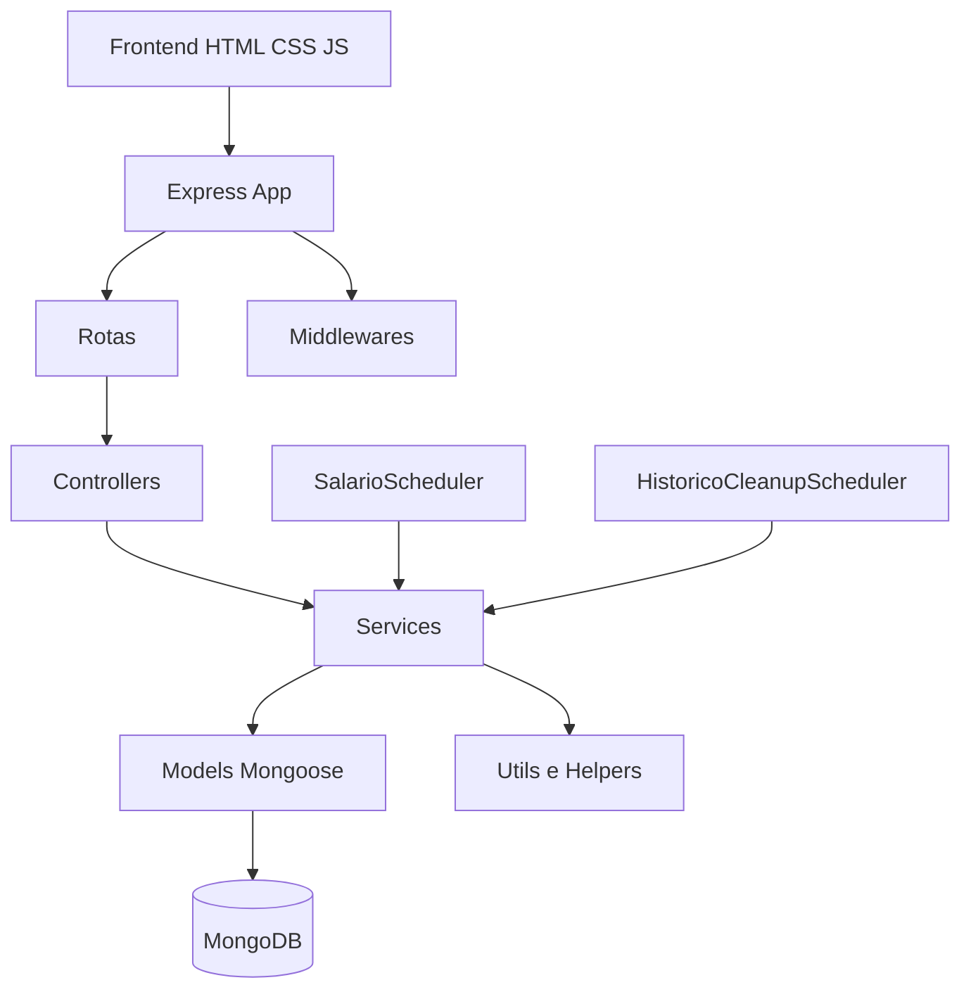
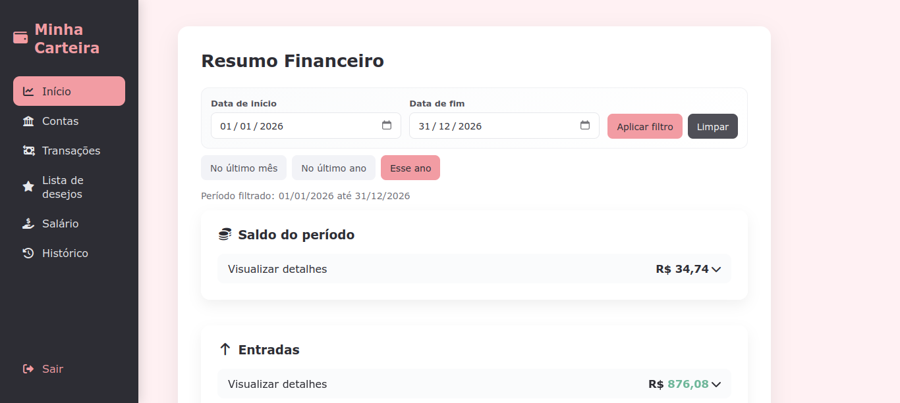
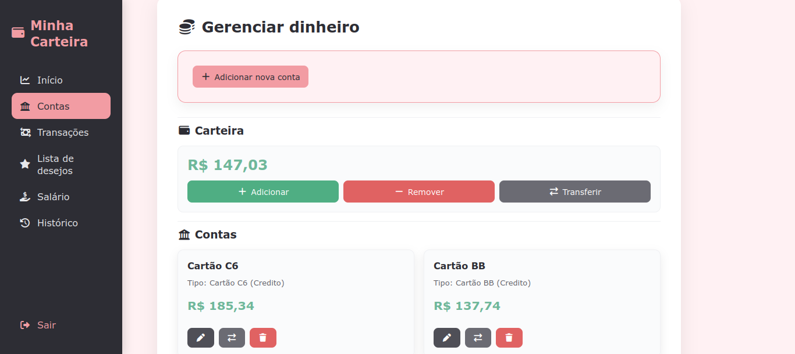
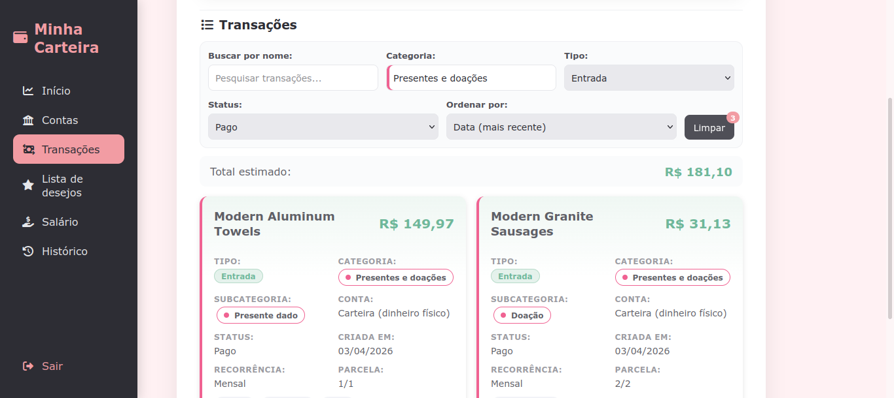
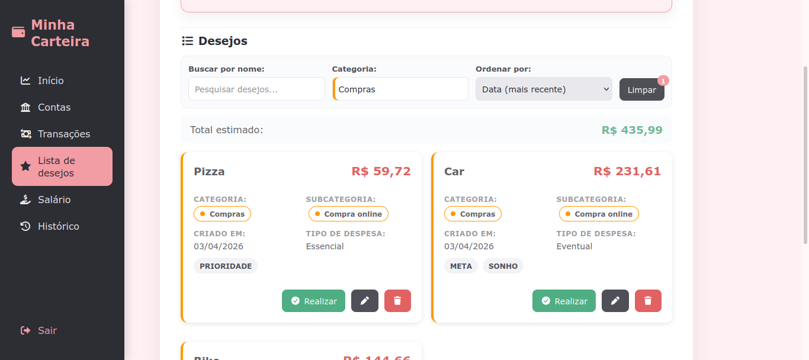
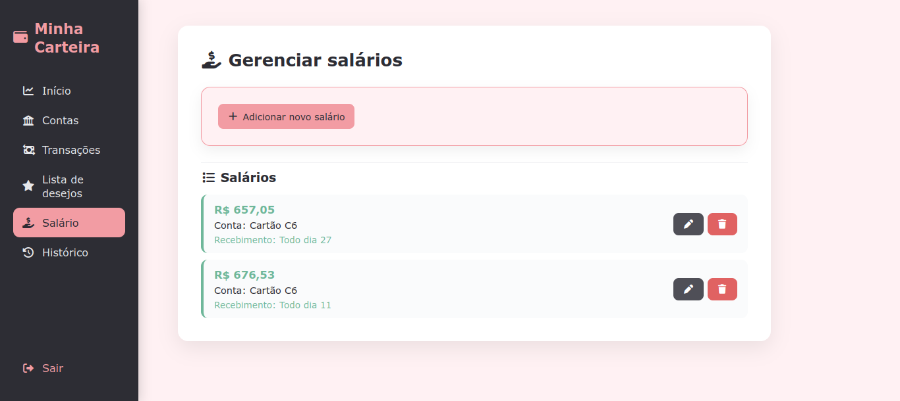
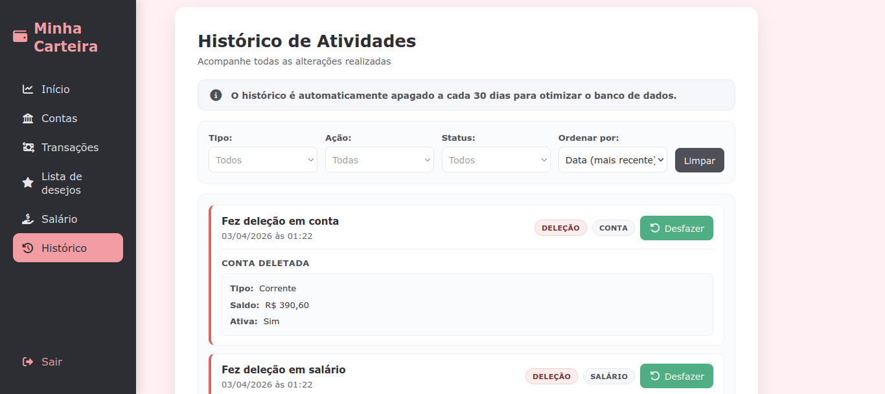

# Controle de Gastos

[](https://nodejs.org/)
[](https://expressjs.com/)
[](https://www.mongodb.com/)
[](https://eslint.org/)
[](https://prettier.io/)
[]()

Sistema de gestão financeira pessoal que permite controlar contas, carteira, transações, lista de desejos, salários recorrentes e projeções de saldo através de uma API REST e interface web integrada.

## Descrição do Sistema

O projeto foi construído para centralizar o acompanhamento financeiro pessoal em uma única aplicação. Ele resolve o problema de dispersão entre contas, dinheiro em carteira, salários futuros e gastos planejados, oferecendo registro estruturado de movimentações, categorização, projeções e rastreabilidade das operações.

Além do CRUD financeiro básico, o sistema inclui automações úteis para o dia a dia, como processamento automático de salários recorrentes e limpeza programada do histórico, mantendo a base consistente sem exigir ações manuais frequentes.

## Sumário

- [Quick Start](#quick-start)
- [Funcionalidades](#funcionalidades)
- [Tecnologias Utilizadas](#tecnologias-utilizadas)
- [Dependências](#dependências)
- [Arquitetura do Sistema](#arquitetura-do-sistema)
- [Estrutura do Projeto](#estrutura-do-projeto)
- [Pré-requisitos](#pré-requisitos)
- [Instalação](#instalação)
- [Configuração](#configuração)
- [Como Executar o Projeto](#como-executar-o-projeto)
- [Documentação da API](#documentação-da-api)
- [Exemplos de Uso](#exemplos-de-uso)
- [Screenshots](#screenshots)

## Quick Start

Para subir o projeto localmente com o mínimo necessário:

```bash
git clone <url-do-repositorio>
cd gastos
npm install
```

Crie um arquivo `.env` na raiz:

```env
MONGO_URL=mongodb://127.0.0.1:27017/gastos
JWT_SECRET=defina_uma_chave_forte
PORT=3000
NODE_ENV=development
```

Opcionalmente, popule a base:

```bash
npm run seed
```

Inicie o ambiente de desenvolvimento:

```bash
npm run dev
```

Abra a aplicação em:

```text
http://localhost:3000/html/login.html
```

## Funcionalidades

- Autenticação de usuários com cadastro, login, logout e validação de sessão.
- Gestão de contas financeiras com criação, edição, exclusão e transferências entre contas.
- Controle de carteira para representar saldo em dinheiro físico separado das contas.
- Cadastro e gerenciamento de transações de entrada e saída.
- Classificação por categoria e subcategoria.
- Suporte a tags, status de pagamento, recorrência e parcelamento.
- Controle específico de salários recorrentes com agendamento automático de processamento.
- Dashboard de resumo financeiro com filtros por período.
- Projeção de saldo com base em movimentações pendentes.
- Lista de desejos com conversão de itens planejados em transações reais.
- Histórico de ações com suporte a desfazer operações.
- Inserção automática de categorias padrão na inicialização do sistema.
- Interface web estática em HTML, CSS e JavaScript vanilla servida pelo próprio backend.

## Tecnologias Utilizadas

### Backend

- Node.js
- Express 5
- MongoDB
- Mongoose
- JWT para autenticação
- bcryptjs para hash de senha
- Zod para validação de entradas
- node-cron para tarefas agendadas
- Helmet para hardening de headers HTTP
- express-rate-limit para limitação de tentativas de autenticação
- CORS configurável por ambiente

### Frontend

- HTML5
- CSS3
- JavaScript moderno com ES Modules
- Font Awesome
- IMask

### Ferramentas de desenvolvimento

- ESLint
- Prettier
- Nodemon
- Faker para geração de dados de seed

## Dependências

Dependências principais identificadas no projeto:

```json
{
  "@fortawesome/fontawesome-free": "^7.2.0",
  "bcryptjs": "^3.0.3",
  "cors": "^2.8.6",
  "dotenv": "^17.3.1",
  "express": "^5.2.1",
  "express-rate-limit": "^8.3.2",
  "helmet": "^8.1.0",
  "imask": "^7.6.1",
  "jsonwebtoken": "^9.0.3",
  "mongodb": "^7.1.0",
  "mongoose": "^9.2.4",
  "node-cron": "^4.2.1",
  "zod": "^4.3.6"
}
```

Dependências de desenvolvimento:

```json
{
  "@eslint/js": "^10.0.1",
  "@faker-js/faker": "^10.3.0",
  "eslint": "^10.1.0",
  "eslint-config-prettier": "^10.1.8",
  "eslint-plugin-prettier": "^5.5.5",
  "globals": "^17.4.0",
  "nodemon": "^3.1.14",
  "prettier": "^3.8.1"
}
```

## Arquitetura do Sistema

O projeto segue uma arquitetura em camadas com backend monolítico em Node.js, API HTTP em Express, persistência em MongoDB e frontend estático servido pelo próprio servidor.

### Visão arquitetural



### Componentes principais

- `app.js`: configura middlewares globais, CORS, CSP, JSON parser, arquivos estáticos e rotas.
- `server.js`: conecta ao banco, garante categorias padrão e inicializa os schedulers.
- `controllers`: camada de entrada HTTP, com delegação da regra de negócio para os serviços.
- `services`: concentra cálculos, fluxo financeiro, manipulação de saldo, histórico e automações.
- `models`: modelagem dos dados persistidos no MongoDB.
- `middlewares`: autenticação, validação, rate limiting, tratamento de erros e wrappers assíncronos.
- `public`: frontend modular em JavaScript vanilla, com páginas dedicadas para resumo, contas, salários, transações, lista de desejos e histórico.

### Fluxos automáticos

- O `SalarioScheduler` roda diariamente e processa salários mensais recorrentes ainda não aplicados no ciclo atual.
- O `HistoricoCleanupScheduler` roda diariamente e remove registros conforme a política de ciclo e retenção configurada por variáveis de ambiente.
- Na inicialização, o sistema garante a existência de categorias padrão no banco para evitar dependência de setup manual.

## Estrutura do Projeto

```text
gastos/
├── package.json
├── eslint.config.mjs
├── md/                         # Documentação interna do projeto
├── scripts/                    # Scripts utilitários e pós-instalação
├── src/
│   ├── app.js                  # Configuração do Express, middlewares e rotas
│   ├── server.js               # Inicialização do servidor, banco e schedulers
│   ├── config/                 # Configurações gerais e categorias padrão
│   ├── controllers/            # Camada HTTP
│   ├── middlewares/            # Autenticação, validação, rate limit e erros
│   ├── models/                 # Schemas Mongoose
│   ├── routes/                 # Definição das rotas da API
│   ├── services/               # Lógica de negócio e agendadores
│   ├── utils/                  # Helpers, seeds, logging e utilitários
│   ├── validation/             # Schemas Zod
│   └── public/                 # Frontend estático servido pelo backend
│       ├── css/
│       ├── html/
│       ├── js/
│       └── vendor/
└── README.md
```

### Pastas principais

- `src/controllers`: recebe a requisição HTTP e delega o processamento para os serviços.
- `src/services`: concentra a regra de negócio, cálculos de saldo, consultas e agendamentos.
- `src/models`: define as entidades persistidas no MongoDB.
- `src/routes`: organiza os endpoints por domínio funcional.
- `src/public`: contém a interface web servida estaticamente pela aplicação.
- `scripts`: reúne geração de CSS temático, cópia de vendors e seed da base.

## Pré-requisitos

Antes de rodar o projeto localmente, garanta que o ambiente tenha:

- Node.js 18 ou superior
- npm 9 ou superior
- MongoDB em execução localmente ou uma instância remota acessível
- Variáveis de ambiente configuradas em um arquivo `.env`

## Instalação

1. Clone o repositório:

```bash
git clone <url-do-repositorio>
cd gastos
```

2. Instale as dependências:

```bash
npm install
```

3. Crie o arquivo `.env` na raiz do projeto.

4. Configure as variáveis de ambiente obrigatórias.

5. Opcionalmente, popule a base com dados iniciais:

```bash
npm run seed
```

## Configuração

As variáveis de ambiente identificadas no código são:

```env
MONGO_URL=mongodb://127.0.0.1:27017/gastos
JWT_SECRET=defina_uma_chave_forte
PORT=3000
NODE_ENV=development
CORS_ORIGINS=http://localhost:3000
AUTH_RATE_LIMIT_WINDOW_MS=900000
AUTH_RATE_LIMIT_MAX=10
HISTORICO_CICLO_DIAS=30
HISTORICO_RETENCAO_DIAS=0
SEED_TEST_NAME=Usuário Teste
SEED_TEST_EMAIL=teste@teste.com
SEED_TEST_PASSWORD=teste123
```

### Observações de configuração

- `MONGO_URL` é obrigatória para conectar o MongoDB.
- `JWT_SECRET` é obrigatória para emissão e validação dos tokens.
- `PORT` define a porta do servidor HTTP.
- `CORS_ORIGINS` aceita uma lista separada por vírgulas para liberar origens externas.
- `AUTH_RATE_LIMIT_WINDOW_MS` e `AUTH_RATE_LIMIT_MAX` controlam a proteção das rotas de autenticação.
- `HISTORICO_CICLO_DIAS` e `HISTORICO_RETENCAO_DIAS` regulam a limpeza automática do histórico.
- As variáveis `SEED_TEST_*` são usadas pelo script de popular dados para ambiente local.

## Como Executar o Projeto

### Ambiente de desenvolvimento

```bash
npm run dev
```

Esse comando:

- gera o arquivo de tema de categorias em CSS;
- inicia o servidor com `nodemon`;
- conecta ao banco;
- garante a existência das categorias padrão;
- sobe os schedulers de salários e limpeza de histórico.

### Popular a base de dados

```bash
npm run seed
```

### Corrigir formatação e lint

```bash
npm run fix
```

### Acessar a aplicação

Com o servidor em execução, acesse:

```text
http://localhost:3000/html/login.html
```

Após autenticação, a navegação principal leva para as páginas da interface, como resumo, contas, transações, salários, histórico e lista de desejos.

## Documentação da API

### Visão geral

A API é organizada por recursos e protegida por autenticação JWT nas rotas de negócio. O token pode ser enviado via header `Authorization: Bearer <token>` e o sistema também possui suporte a autenticação por cookie HTTP-only.

### Convenções principais

- Rotas de autenticação usam rate limiting.
- Rotas protegidas usam middleware de autenticação.
- Entradas, parâmetros e queries são validados com Zod.
- Respostas de erro seguem tratamento centralizado via middleware global.
- O backend serve também os arquivos estáticos do frontend.

### Recursos disponíveis

#### Autenticação

```text
POST   /usuarios/registrar
POST   /usuarios/login
GET    /usuarios/sessao
POST   /usuarios/logout
```

#### Contas

```text
POST   /contas
GET    /contas
PUT    /contas/:id
DELETE /contas/:id
POST   /contas/:id/transferir
```

#### Carteira

```text
GET    /carteira
PUT    /carteira
POST   /carteira/transferir
```

#### Transações

```text
POST   /transacoes
GET    /transacoes
PUT    /transacoes/:id
DELETE /transacoes/:id
```

#### Salários

```text
POST   /salarios
GET    /salarios
PUT    /salarios/:id
DELETE /salarios/:id
```

#### Resumo financeiro

```text
GET    /resumo
GET    /resumo/projecao
```

#### Lista de desejos

```text
POST   /lista-desejos
GET    /lista-desejos
POST   /lista-desejos/:id/realizar
PUT    /lista-desejos/:id
DELETE /lista-desejos/:id
```

#### Categorias

```text
GET    /categorias
GET    /categorias/:id/subcategorias
```

#### Histórico

```text
GET    /historico
GET    /historico/:entidade/:entidadeId
POST   /historico/:id/desfazer
```

### Filtros e comportamento observados

- `GET /resumo` e `GET /resumo/projecao` aceitam filtros de período via `dataInicio` e `dataFim`.
- `GET /transacoes` e `GET /lista-desejos` suportam ordenação por query.
- `GET /historico` suporta filtros por entidade, ação, status de desfazer, paginação por `limit` e `skip` e ordenação.

## Exemplos de Uso

### Fluxo básico pela interface

1. Registrar um usuário em `/html/registrar.html`.
2. Fazer login em `/html/login.html`.
3. Criar uma conta financeira.
4. Lançar entradas, saídas ou salários.
5. Consultar o resumo em `/html/inicio.html`.
6. Acompanhar histórico e usar a funcionalidade de desfazer quando necessário.

### Exemplo de autenticação

```bash
curl -X POST http://localhost:3000/usuarios/registrar \
  -H "Content-Type: application/json" \
  -d '{
    "nome": "Maria",
    "email": "maria@example.com",
    "senha": "123456",
    "salario": 3500
  }'
```

### Exemplo de login

```bash
curl -X POST http://localhost:3000/usuarios/login \
  -H "Content-Type: application/json" \
  -d '{
    "email": "maria@example.com",
    "senha": "123456"
  }'
```

### Exemplo de criação de conta autenticada

```bash
curl -X POST http://localhost:3000/contas \
  -H "Content-Type: application/json" \
  -H "Authorization: Bearer <token>" \
  -d '{
    "nome": "Conta Corrente",
    "tipo": "corrente",
    "saldo": 1000
  }'
```

### Exemplo de criação de transação

```bash
curl -X POST http://localhost:3000/transacoes \
  -H "Content-Type: application/json" \
  -H "Authorization: Bearer <token>" \
  -d '{
    "conta": "<id-da-conta>",
    "titulo": "Mercado",
    "valor": 150.50,
    "tipo": "saida",
    "categoria": "<id-da-categoria>",
    "status": "pago",
    "tags": ["alimentacao", "semanal"]
  }'
```

### Exemplo de consulta de resumo por período

```bash
curl -X GET "http://localhost:3000/resumo?dataInicio=2026-03-01&dataFim=2026-03-31" \
  -H "Authorization: Bearer <token>"
```

## Screenshots

Capturas reais da interface atual da aplicação.

### Login


### Cadastro


### Início



### Contas



### Transações



### Lista de desejos



### Salário



### Histórico


